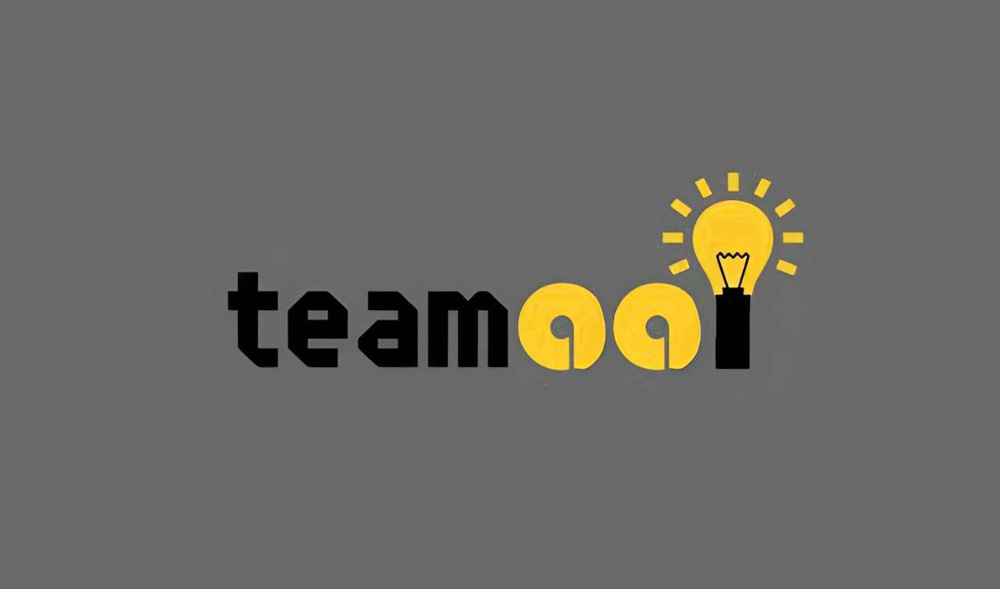

<h1 align="center" color="blue">
<strong>𓂃˖ ࣪⊹ TEAM 001 ✮⋆˙</strong>
</h1>
<h2 align="center">𝐖𝐄𝐋𝐂𝐎𝐌𝐄</h2>

# ⭑ 📃Table of Contents 
  - [Introduction](#who-are-we-and-whats-our-project-about)
  - [Team members](#team-members)
  - [Our application](#what-our-application-does)
  - [Technologies](#used-technologies)
  - [Installing & running the project](#how-to-install-and-run-the-project)
  - [Using the project](#how-to-use-the-project)
  - [Help/Questions](#-where-to-get-help)

# ⭑🧑‍🎓Who are we and what's our project about?

## We are TEAM 001. Our project is based on the C++ programme-TEST, which helps users to test their general knowledge! There are some basic facts everybody has to be aware of, right? If you wanna find out wether your general knowledge is good enough, take our 25-questions test. However, be careful: there are 3 difficulties:
 ;  ; ;ㅤㅤㅤㅤ
                            ㅤ   

# ⭑🫂Team Members
- ### Daria Larichkina (as a team leader and full stack developer);
- ### Denis Zavalishin (as a back end developer);
- ### Elizaveta Furnika (as a front end developer);
- ### Varvara Safonova (as a designer);
- ### Svyatoslav Sidorov (as a designer);
- ### Nikol Stoyanova (as a mentor);

# ⭑💡What our Application does?
## Our application consists of a main file, headers, and functions related to each other. This structure ensures a more efficient and comprehensive approach to code implementation. Most questions require numerical answers; however, there are also open-ended questions where users must type their responses. At the end of the test, users receive a grade based on their answers. The highest grade is 6, indicating an excellent result, while the lowest grade is 2, signifying a poor outcome.
# ⭑💻Used Technologies:
- ### COMMUNICATION    
- ### PROGRAMMING LANGUAGE 
- ### APPS     
- ### DOCUMENTATION  
   

# ⭑📥How to Install and Run the Project
### In order to install our project locally, open CMD and run this command:
<pre>git clone "https://github.com/codingburgas/sprint-eschool-team001.git"</pre>

# ⭑🚀How to Use the Project 
### You can use our project multiple times, trying to get the highest grade on different difficulties. You can also test your friends or family members, have great fun and learn new interesting information. We've carefully chosen from the most common facts to the ones which will blow your mind! Some of the questions require typing an answer, but don't worry, any special requirements will be indicated in the brackets. 

# 📧 Where to Get Help
### If you need help with this project, you can use the following resources:

## 1. **Documentation**: Check the official documentation for detailed guides and references.
   
## 2. **Microsoft Teams**.
   Elizaveta - evfurnika23@codingburgas.bg
   
   Daria - dalarichkina23@codingburgas.bg
   
   Varvara - vnsaphonova23@codingburgas.bg
   
   Svyatoslav - svsidorov23@codingburgas.bg

   Denis - ddzavalishin23@codingburgas.bg

   Nikol - nsstoyanova22@codingburgas.bg
## 3. **Email Support**: For more personalized help, you can email us. The email adresses are equal to the ones above.

### Feel free to reach out through any of these options, and we'll be happy to assist you!❤️
